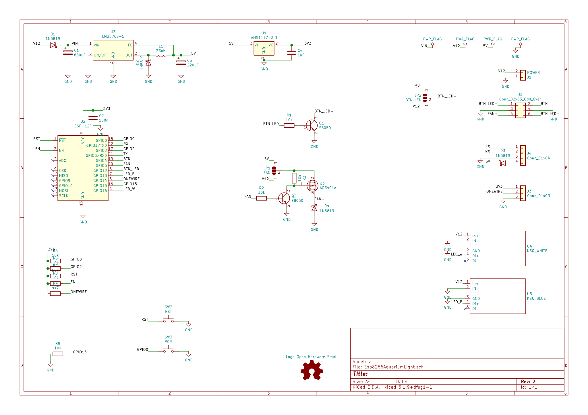
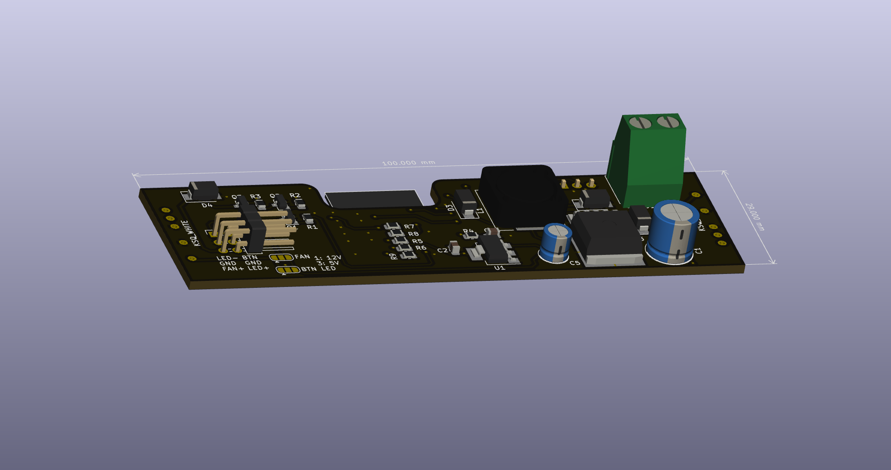
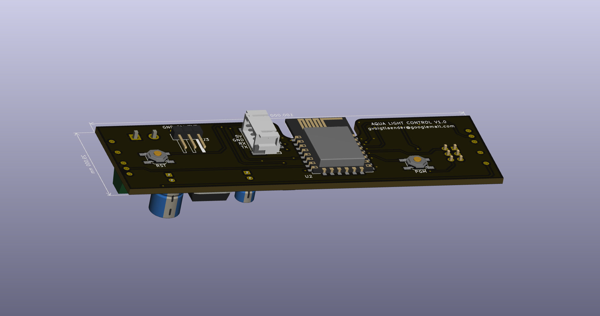
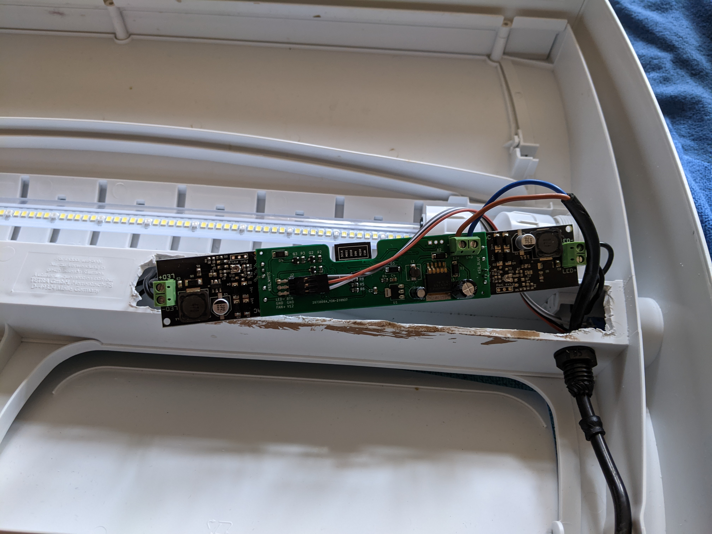
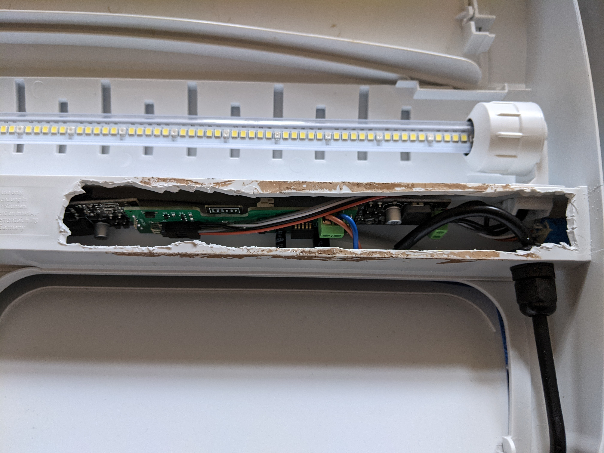
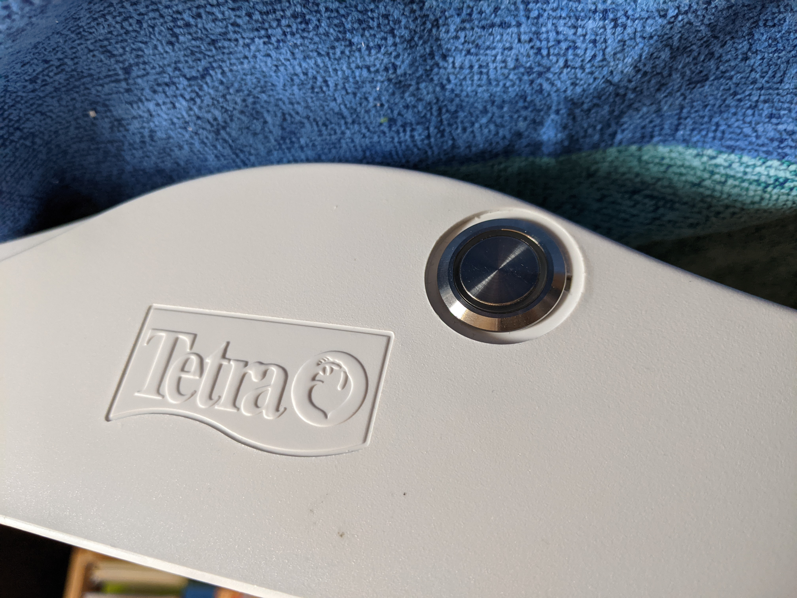

# Esp8266AquariumLight
## ESP8266, KSQ-1A, LM2576S, PWM

## Project goals:
* time-based control of 2 separate PWM channels to adjust LED light intensity
* small footprint to integrate into given aquarium cover (max hight: 30mm)
* generate all voltages from given 12V supply
* onboard programmer interface (RX/TX, buttons)
* support for available constant power supply modules (KSQ 1A, pin-compatible to add-on)
* support external button to switch states
* support external button LED light to indicate states
* optional ONEWIRE temperature sensor (e.g. DS18B20)
* optional FAN output (switchable)

## Used items:
* LM2576S Step-Down (12V -> 5V)
* AMS1117-3.3 LDO (5V -> 3.3V)
* ESP8266 (ESP-12F) as CPU
* general purpose MOSFET & BJT
* resistors, capacitory (SMD 0805)

## Schematic:

## PCB:

## Assembly

